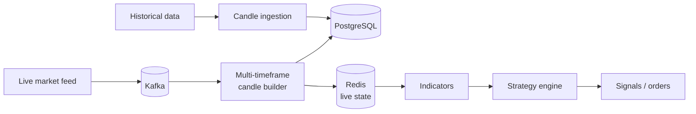

 

---

## 👋 About

Computer Engineering student who builds backend systems that stay correct under load and failure.

I work at the intersection of **event-driven architecture**, **data-intensive services**, and **market-data infrastructure**, and I like knowing *why* something works before I rely on the abstraction on top of it.

|  |  |
|---|---|
| 🔭 **Building** | A distributed job queue, a market-data and strategy engine, and a Kubernetes lab |
| 🌱 **Going deeper on** | Linux internals, networking, concurrency, C++ and CPU/cache behavior |
| 💬 **Ask me about** | Kafka, Redis-backed state, retries and dead-letter queues, look-ahead-free backtesting |

---

## 🚀 Featured Projects

<table>
<tr>
<td width="50%" valign="top">

### ⚡ Distributed Job Queue & Worker Engine
Reliable async job processing built for failure.

- Retries with backoff and dead-letter queues
- Delayed jobs and failure recovery
- Concurrent workers, Redis-backed distributed state
- Durable job records in PostgreSQL

`Node.js` `TypeScript` `Redis` `PostgreSQL`

[**View repo →**](#) <!-- add link -->

</td>
<td width="50%" valign="top">

### 📈 Market Data & Trading Engine
Historical and real-time market-data processing.

- Historical candle ingestion
- Multi-timeframe candle generation
- Kafka event streaming, Redis live state
- Indicators and strategy execution with **zero look-ahead / repainting**

`Python` `Kafka` `Redis` `PostgreSQL`

[**View repo →**](#) <!-- add link -->

</td>
</tr>
<tr>
<td width="50%" valign="top">

### ☸️ Kubernetes Infrastructure Lab
Production-style cloud-native setup.

- Containerized services and ingress/service networking
- GitLab CI/CD pipelines
- Centralized logging and observability
- Infrastructure automation with Terraform

`Kubernetes` `Linux` `GitLab CI/CD` `Terraform`

[**View repo →**](#) <!-- add link -->

</td>
<td width="50%" valign="top">

### 📞 Asterisk VoIP System
Real-time voice communication for low-bandwidth networks.

- Call handling on constrained links
- Containerized deployment

`Asterisk` `Linux` `Docker`

[**View repo →**](#) <!-- add link -->

</td>
</tr>
</table>

---

## 🧩 How the Market Data Engine Fits Together

Strategies only ever see **closed** candles, so signals can't repaint or peek at future data.

---

## 🛠️ Tech Stack

  
   
  
   
  
   
  

<b>Full list</b>

| | |
|---|---|
| **Languages** | C++ · Python · TypeScript · JavaScript |
| **Backend** | Node.js · Express · REST APIs |
| **Data & messaging** | PostgreSQL · Redis · Kafka · MongoDB |
| **Infra & DevOps** | Linux · Kubernetes · Podman · GitLab CI/CD · Terraform · AWS |
| **Tools** | Git · GitHub · Postman |

---

## 📚 Currently Learning

| Systems | Backend | Performance |
|---|---|---|
| Linux internals | Kafka | C++ |
| Networking | PostgreSQL internals | Memory management |
| Operating systems | Node.js internals | CPU / cache behavior |
| Concurrency | System design | Data structures & algorithms |

---

## 🎯 Engineering Philosophy

> **Understand the system before using the abstraction.**

<b>Questions I keep coming back to</b>

- What actually happens inside the runtime?
- Where does latency come from?
- What happens when a service fails halfway through a job?
- How do we guarantee correctness under concurrency?
- How can a system scale without becoming fragile?

---

## 📊 GitHub Activity

